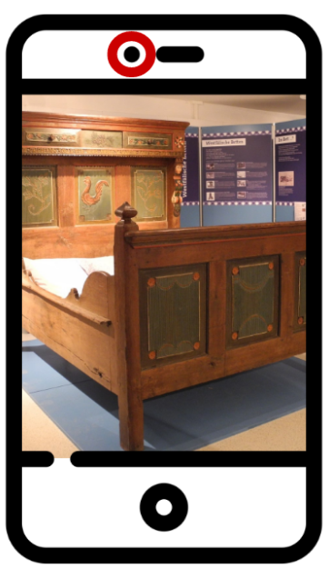
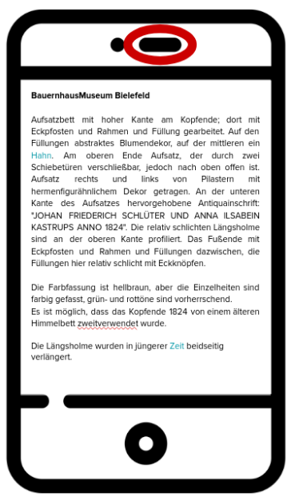

# Projekt *Digitales Museum*

Das Community-Projekt teilt sich in zwei Unterprojekte auf: 
1. Digitalisierung von Exponaten und 
2. Web-Applikation zur Exponatserkennung.

Hierbei ist mit 1. die digitale Erfassung von Exponaten mittels der Plattform [museum-digital](https://museum-digital.de/) gemeint, während 2. die Erstellung einer mobilen Webseite beinhaltet, welche die Beschreibungstexte von der Plattform museum-digital bedarfsgerecht für Museumsbesucher zur Verfügung stellt.

Hierdurch können verschiedenste Ziele erreicht werden, unter anderem:
- Ansprache von jungen Museumsbesucher und den sogenannten *Digital Natives*,
- Exponate und ihre Beschreibungen sind außerhalb der Öffnungszeiten konsumierbar.
- Seh- und Hörbehinderte können gezielt durch Sprachausgabe von Beschreibungen, kontrastreichen Darstellungen oder extra großen Schriftarten inkludiert werden,
- Neue Ausstellungsmöglichkeiten wie Pop-Up-Mussen werden ermöglicht, da unser Konzept keine gesonderten QR-Codes oder ähnliches verwendet.
- Die Verlinkung zwischen Exponaten kann gezielt hinterlegt werden, sodass ganze digitale Führungen durch Exponatssammlungen ermöglicht werden.

## Digitalisierung von Exponaten
Zunächst sollen - angefangen mit den ausgestellten Exponaten - Teile der Sammlung eines kleinen Museums im Bielefelder Umland digitalisiert werden. Folgende Schritte sind notwendig:
1. Exponatsbeschreibungen zusammenstellen bzw. erstellen wenn diese noch nicht vorliegen,
2. eine Sammlung von Bildern und ein 360° Kurz-Video des jeweiligen Exponats erstellen,
3. *Digitale Zwillinge* der Exponate auf [museum-digital](https://museum-digital.de/) anlegen.

Da sich [Code for Bielefeld](https://codefor.de/bielefeld/) primär in der Rolle einer Entwicklung sieht und die ehrenamtlichen Helfer zumeist keine Ausbilung im Museumswesen besitzen, sollten die obigen Schritte von Fachpersonal ausgeführt werden.

Vorstellbar wäre hier, eine Kooperation mit hiesigen Hochschulen einzugehen, sodass z.B. Geschichtsstudenten in Form von Seminaren oder ähnlichen Veranstaltungen diese Aufgaben übernehmen. 

## Web-Applikation zur Exponatserkennung

Sobald Exponate mit ihren Beschreibungen und 360° Kurz-Videos online zur Verfügung stehen, können diese für Web-Applikationen genutzt werden. 

Wir möchten mittels KI-Verfahren zur Bilderkennung die Exponate von der Kamera eines Smartphones erkennen lassen, sodass im Anschluss der Benutzer die Beschreibungen, aber auch Sprachausgabe und Verlinkungen verwenden kann. 
D.h. es sind insbesondere keine weiteren Hilfsmittel wie QR-Codes oder dergleichen notwendig, lediglich das Bild eines Exponats wird genutzt.

In diesem Kontext sind die 360° Kurz-Videos sehr wichtig, da eine Bilderkennung nur mittels vieler Testbilder trainiert werden kann. Anstelle von X vielen manuell geknipsten Bildern lassen sich die einzelnen Frames der Videos für diesen Projektschritt nutzen.

## Proof-of-Concept
In einem ersten Schritt möchten wir einen Prototypen einer solchen Web-Applikationen bauen, anhand folgender Schritte:
1. Minimale Web-App auf Basis von ?? (Z.B. HTML5, Bootstrap und Flask)
2. Transfer-Learning eines existierenden Neuronalen Netzes wie YOLOv4 zur Bilderkennung
3. Python-Skript zum Aufbereiten der Bilder auf Basis von Video-Frames

